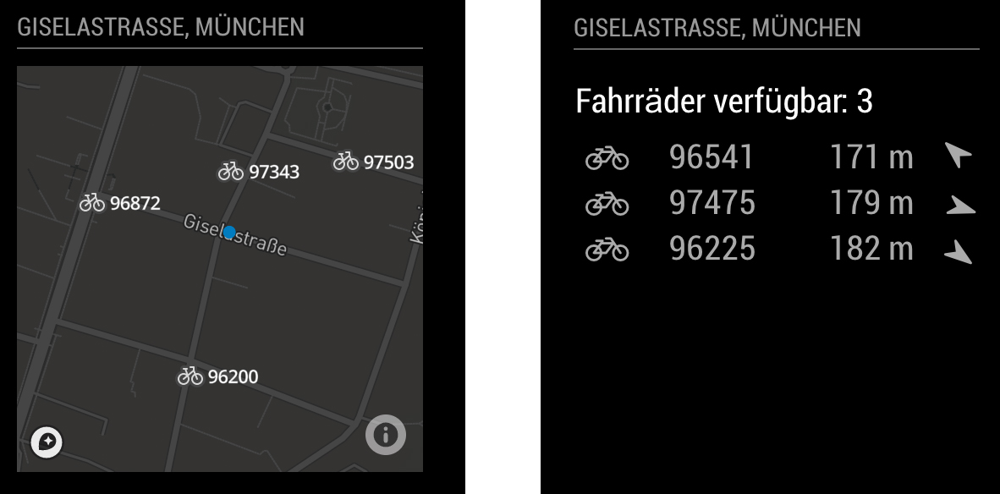

# MMM-mvg-rad
This is a Magic Mirror 2 module, that lists all available rental bikes from MVG Rad (Munich Public Transport) in a given search radius.

It displays either a table with `bike number`, `distance to walk` and `direction`, or displays a map with the bikes.

## Screenshots

## Current version

v0.0.1 - Beta

## Prerequisite
A working installation of [MagicMirror2](https://github.com/MichMich/MagicMirror)
 
## Dependencies
  * npm
  * [request](https://www.npmjs.com/package/request)
  * [turf](https://www.npmjs.com/package/xml2js)
  * Mapbox API Key, only needed if you want to display the bikes on a map -> [Get your free key here](https://www.mapbox.com/account/access-tokens)

## Installation
1. Navigate into your MagicMirror's `modules` folder.
2. Execute `git clone https://github.com/vmarquar/MMM-mvg-rad.git`.
3. Execute `cd MMM-mvg-rad`.
4. Execute `npm install`.

## Configuration
Sample minimum configuration entry for your `~/MagicMirror/config/config.js`:

    ...
    
		{
			module: "MMM-mvg-rad",
			position: "bottom_left",
			config: {}
		}, // if this is your last module remove the comma!
    
    ...

Sample configuration entry for your `~/MagicMirror/config/config.js` with optional parameters:

    ...
    {
        module: "MMM-mvg-rad",
        position: "bottom_left",
        config: {
            MAX_ITEMS: 5, // Maximum items to display in the table view
            refresh_rate: 3 * 60 * 1000, //milliseconds
            stationName: "MVG Rad", // Your Header name, e.g. your home location
            center: [11.53468800, 48.16904000], // the center point from your search in lat/long coordinates (WGS84) --> get it e.g. from Google Maps
            radius: 200, // the search radius in meter
            bearingCorrection: 0, // 0 is north, you can enter a correction to adapt the direction arrows from your mirror's "point of view"
            returnType: "return_table", //Options are: "return_geojson" or "return_table"
            mapboxAPI: "",
            mapboxStyle: 'mapbox://styles/mapbox/dark-v9',
            text_color: "#FFFFFF"
        }
    }, // if this is your last module remove the comma!
    ...

## Licence
MIT License

Copyright (c) 2016 vmarquar / Valentin

Permission is hereby granted, free of charge, to any person obtaining a copy
of this software and associated documentation files (the "Software"), to deal
in the Software without restriction, including without limitation the rights
to use, copy, modify, merge, publish, distribute, sublicense, and/or sell
copies of the Software, and to permit persons to whom the Software is
furnished to do so, subject to the following conditions:

The above copyright notice and this permission notice shall be included in all
copies or substantial portions of the Software.

THE SOFTWARE IS PROVIDED "AS IS", WITHOUT WARRANTY OF ANY KIND, EXPRESS OR
IMPLIED, INCLUDING BUT NOT LIMITED TO THE WARRANTIES OF MERCHANTABILITY,
FITNESS FOR A PARTICULAR PURPOSE AND NONINFRINGEMENT. IN NO EVENT SHALL THE
AUTHORS OR COPYRIGHT HOLDERS BE LIABLE FOR ANY CLAIM, DAMAGES OR OTHER
LIABILITY, WHETHER IN AN ACTION OF CONTRACT, TORT OR OTHERWISE, ARISING FROM,
OUT OF OR IN CONNECTION WITH THE SOFTWARE OR THE USE OR OTHER DEALINGS IN THE
SOFTWARE.
